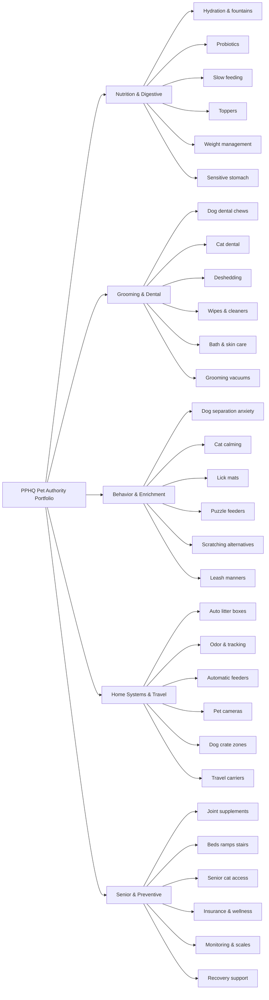
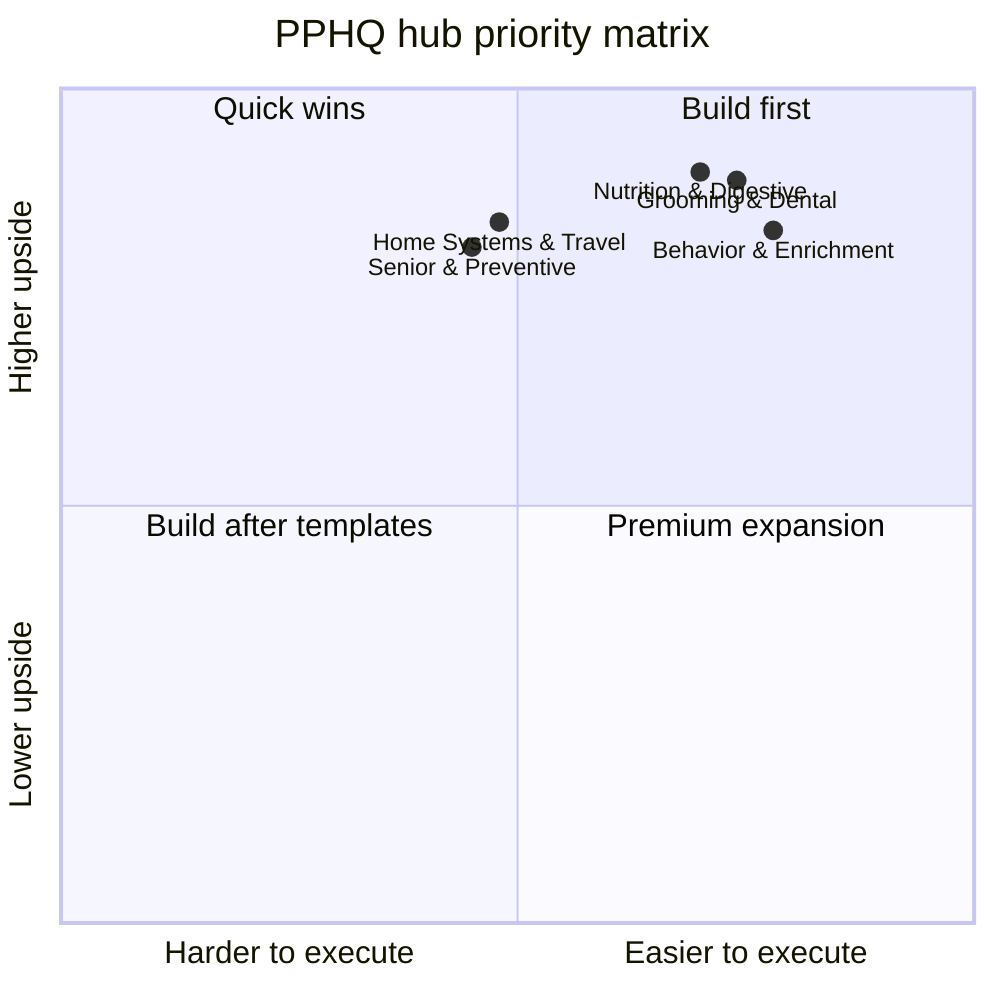

# Cat and Dog Hub Portfolio for PPHQ

## Executive summary

**Confirmed facts.** The U.S. pet market is large enough to support a full hub-and-spoke authority model: the entity["organization","American Pet Products Association","pet trade association"] says U.S. pet industry sales reached **$157 billion in 2025** and are projected to exceed **$164 billion in 2026**; a related APPA-backed statistic puts U.S. pet ownership at **94 million households**, including roughly **68 million dog-owning** and **49 million cat-owning** households. APPA’s 2025 dog-and-cat reporting also highlights a **23% jump in cat-owning households in 2024**, making cat demand materially more attractive than many legacy dog-heavy content strategies assume. citeturn0search3turn23search13turn23search0turn23search6

The strongest portfolio for PPHQ is not “all pet content.” It is five evergreen commercial pillars: **Nutrition, Hydration & Digestive Health**; **Grooming, Dental & Shedding Control**; **Behavior, Anxiety & Enrichment**; **Home Systems, Cleanup & Travel**; and **Senior Mobility & Preventive Care**. These five hubs align with the biggest persistent purchase signals visible in public marketplaces, with especially strong tailwinds in fountains, feeders, digestive supplements, dental products, self-cleaning litter systems, grooming consumables, joint care, and insurance-adjacent education. citeturn10search2turn8search1turn21search0turn14search2turn11search4turn7search0

The highest-priority opportunities are the spoke clusters where **evergreen information demand**, **commercial intent**, and **repeatable monetization** overlap. The best examples are **dog dental chews**, **cat hydration/fountains**, **probiotics and gut reset**, **joint supplements/fish oils**, **wipes/quick-clean grooming**, **dog separation-anxiety routines**, and **self-cleaning litter boxes**. These topics sit close to real veterinary pain points: periodontal disease is extremely common by age three, pet obesity is widespread, arthritis is common in senior pets, and pet insurance continues to grow double digits. citeturn17search18turn17search1turn33search13turn6search5turn7search0turn7search8

**Core strategic conclusion.** For SEO and commerce together, PPHQ should bias toward **problem-solution systems** rather than isolated “best product” listicles. The gap in the market is not more generic pet advice. It is **vet-informed, species-specific, routine-driven content** that moves the user from symptom or goal to product decision to replenishment or bundle. That gap is visible because current winners are fragmented across broad publishers, marketplaces, and brand pages rather than unified around an owned authority journey. citeturn30search0turn30search5turn31search2turn30search2turn21search6turn21search0

## Confirmed facts, assumptions, and method

### Confirmed facts

The most important market facts shaping this recommendation are straightforward. First, the U.S. market is large and still growing. Second, cat ownership is accelerating faster than many content portfolios reflect. Third, pet insurance is growing quickly: the entity["organization","North American Pet Health Insurance Association","pet insurance trade group"] reported **7.03 million insured pets in North America at the end of 2024**, up **12.2%** year over year, with the U.S. market alone growing **12.7%** in total insured pets over 2023. Fourth, major health pain points are persistent and therefore structurally SEO-friendly: the entity["organization","American Veterinary Medical Association","veterinary association"] says periodontal disease is the most common dental condition in dogs and cats and is very likely present in some early form by age three, while the entity["organization","Association for Pet Obesity Prevention","pet obesity nonprofit"] and related veterinary sources continue to describe obesity as one of the most common health problems in companion animals. citeturn7search0turn7search8turn17search18turn33search1turn33search13

### Assumptions

I assumed the **U.S. market** because no geography was specified. I treated **PPHQ as your internal content and product framework**, because public search results for that acronym point to an unrelated non-pet business rather than a recognizable pet-commerce brand or media property. I also assumed no hard constraint on affiliate vs. private-label mix, so the report emphasizes platforms where either model can work. citeturn22search0

### Demand methodology

The demand indicators below are **directional estimates**, not exact keyword-planner exports. I weighted public primary-source proxies more heavily than generic SEO-tool estimates: marketplace purchase velocity from entity["company","Amazon","ecommerce company"] search and bestseller pages, review density and autoship/comparison pages from entity["company","Chewy","pet ecommerce retailer"], veterinary guidance from groups such as the entity["organization","American Association of Feline Practitioners","veterinary association"], and category-growth context from APPA and NAPHIA. The shorthand demand bands mean:

- **Very high**: broad evergreen demand with strong commerce proof, usually visible as 10K+ monthly marketplace purchases or very heavy review density.
- **High**: durable category demand with visible transactional traction, usually 1K–10K monthly marketplace purchases or strong ratings/reviews.
- **Medium-high**: narrower but still meaningful demand, often species-, life-stage-, or device-specific. citeturn10search2turn8search1turn21search0turn20search0turn17search5turn23search0turn7search0

### Competitive read

Across the portfolio, the most visible SERP and commerce competitors are entity["organization","PetMD","pet health publisher"], entity["organization","Cats.com","cat media publisher"], the entity["organization","American Kennel Club","dog registry organization"], the entity["organization","American Society for the Prevention of Cruelty to Animals","animal welfare nonprofit"], major nutrition brands such as entity["company","Purina","pet food company"], entity["company","Royal Canin","pet food company"], and entity["company","Hill's Pet Nutrition","pet food company"], plus marketplace-led comparison pages. The consistent gap is that these players often win **either** the medical explainer **or** the product list **or** the transaction, but not the whole user journey. citeturn30search0turn30search5turn34search2turn31search2turn30search2turn34search6

## Recommended hub portfolio

| Hub | Why it belongs in the core portfolio | Best monetization paths | Traffic / Ease / Margin | Composite priority |
|---|---|---|---|---|
| **Nutrition, Hydration & Digestive Health** | Strongest mix of recurring consumables, symptom-led SEO, and cat/dog cross-sell. Fountain, probiotic, feeder, slow-feed, topper, and weight-management demand is visible in both Amazon and Chewy. citeturn10search2turn8search1turn20search0turn21search6 | Affiliate, private label, bundles, subscriptions | 4.5 / 4.1 / 4.3 | **87** |
| **Grooming, Dental & Shedding Control** | High-frequency problems, strong repeat purchase, and easy visual/video content. Dental, wipes, brushes, shampoo, and grooming tools have strong proof-of-demand. citeturn21search0turn9search1turn24search0turn14search20turn35search12 | Affiliate, private label, subscriptions, reorder reminders | 4.4 / 4.3 / 4.3 | **87** |
| **Behavior, Anxiety & Enrichment** | High SEO need, strong user pain, and solid product attach rates through toys, mats, calming aids, and cameras. Particularly good for video and email retention. citeturn11search0turn5search3turn10search0turn15search5turn13search1 | Affiliate, bundles, subscriptions, digital programs | 4.2 / 4.3 / 4.0 | **83** |
| **Home Systems, Cleanup & Travel** | Lower ease than consumables, but strong AOV from automation, room systems, carriers, crates, and cleanup gear. Especially attractive for cats. citeturn14search2turn20search0turn25search12turn12search3turn26search3 | Affiliate, premium bundles, device accessories, warranties | 4.2 / 3.9 / 4.4 | **84** |
| **Senior Mobility & Preventive Care** | Strong emotional purchase motivation and high-margin baskets around mobility, home access, monitoring, and insurance content. citeturn11search4turn30search11turn26search5turn26search6turn7search0 | Affiliate, private label add-ons, insurance leads, bundles | 4.0 / 3.8 / 4.4 | **82** |

The portfolio architecture below is the cleanest way to connect broad evergreen authority pages to monetizable spokes and product modules. The structure reflects the strongest opportunities visible in marketplace demand and veterinary problem prevalence. citeturn23search0turn17search18turn21search0turn10search2

## Hub details

### Nutrition, Hydration & Digestive Health

This should be the first large content-and-commerce hub because it combines **high repetitive need**, **clear pet-parent problem language**, and **strong replenishment potential**. APPA’s 2025 dog-and-cat reporting specifically calls out proactive wellness and premium, functional food trends, while Amazon and Chewy show heavy traction for fountains, probiotics, automatic feeders, toppers, and slow-feed products. The competitor set is strong, but fragmented: PetMD and Cats.com do well on “best” queries, while brand pages and marketplaces dominate the transaction. The gap is a **routine-based nutrition system**: symptom → diagnosis guardrails → product stack → replenishment cadence. citeturn23search0turn10search2turn21search6turn21search1turn30search0turn30search5turn30search2

| Spoke | Persona and search intent | Best content types | Product categories and 4 specific ideas | Demand, competitive gap, monetization, score |
|---|---|---|---|---|
| **Cat hydration & fountains** — Drive more drinking, especially for indoor cats and multi-cat homes. | Indoor-cat parents; concern-led informational and commercial investigation. | “Best fountains” article, cleaning guide, replacement-filter explainer, short video on placement and maintenance. | **Hydration hardware + replenishment**: stainless-steel fountain (easy cleaning), filter multipack (subscription), fountain-cleaning brush kit (maintenance pain point), splash/overflow mat (AOV lift). | **Very high.** Amazon shows cat fountains at 30K+ bought in past month; Chewy’s fountain category is heavily reviewed; AAFP supports fountains as one strategy to improve water intake. Gap: most pages stop at product ranking and do not build a hydration routine or subscription path. Monetization: affiliate first, then own-label filters/cleaning kits. **Score: 92.** citeturn10search2turn10search18turn21search6turn17search5turn23search6 |
| **Digestive reset & probiotics** — Diarrhea, food transition, stools, gas, and stress-related GI content. | Dog and cat owners facing acute digestibility issues; problem-solving intent. | Symptom-based guide, “when to call your vet” article, product comparison, stool-quality checklist, email mini-course. | **Supplements + functional add-ons**: probiotic chew/powder (daily support), single-serve sachets (travel/transition use), pumpkin-fiber topper (firm stool support), storage caddy with dosing spoon (habit tool). | **Very high.** Dog probiotics show 10K+ bought monthly on Amazon; cat probiotics show 1K+ monthly; Chewy’s best-selling probiotic pages have very high review density. Gap: choosing by symptom, life stage, or duration remains weak. Monetization: affiliate, private-label probiotic, subscribe-and-save replenishment. **Score: 92.** citeturn8search1turn10search1turn10search25turn21search1turn21search4turn30search0 |
| **Slow feeding & anti-gulp systems** — Overeating, speed eating, boredom eating, regurgitation prevention. | Fast-eating dog owners, indoor-cat parents, weight-conscious households; mostly commercial investigation. | Comparison guide, quiz, bowl-calculator, short-form demo video, “wet vs dry compatibility” guide. | **Feeding accessories**: maze bowl (slows intake), slow-feed insert (retrofits existing bowls), lick mat (multi-use), non-slip food station tray (cleaner setup). | **High.** Amazon slow-feeder and licking-mat queries show strong volume and repeated purchase signals. Gap: strong product pages exist, but breed-size matching and meal-type decision tools are thin. Monetization: affiliate, low-cost private label accessories, bundles with toppers and feeders. **Score: 84.** citeturn8search6turn8search30turn15search5turn16search13 |
| **Picky eaters & meal toppers** — Flavor variety, food rotation, appetite support, texture upgrades. | Picky-dog and picky-cat households; commercial investigation. | “How to get a picky pet to eat” guide, topper comparison, 7-day rotation planner, taste-test video. | **Meal enhancers**: freeze-dried topper (high-protein appeal), bone-broth topper (moisture and aroma), salmon-oil pump (skin/coat plus palatability), trial-size topper sampler (conversion-friendly pack). | **High.** Freeze-dried toppers and topper-adjacent categories show consistent Amazon traction across dogs and cats. Gap: few sites build sample-pack logic, rotation advice, or cross-sell from toppers to hydration/slow-feed tools. Monetization: affiliate, private-label sampler bundles, subscriptions. **Score: 87.** citeturn15search0turn15search23turn16search6turn16search25turn16search29turn15search36 |
| **Weight management systems** — Portion control, treat budgeting, and habit-based weight loss. | Owners of overweight pets; informational plus commercial investigation. | Weight-loss starter guide, body-condition explainer, portion-control calculator, feeder comparison, success-story video. | **Weight-control tools**: portion-control automatic feeder (consistency), measuring scoop set (low-friction routine), treat-portion jar (behavioral support), BCS fridge magnet or printable (education + lead gen). | **High.** Obesity remains one of the most common pet-health problems, while automatic feeders and slow-feeding tools have visible marketplace demand. Gap: current content is often advice-only and under-productized. Monetization: affiliate feeders, owned accessories, bundle kits, email follow-up offers. **Score: 86.** citeturn33search13turn33search0turn10search7turn20search0turn20search2turn8search6 |
| **Sensitive-stomach starter guides** — Limited ingredients, transitions, and elimination logic for upset-prone pets. | Cats and dogs with recurrent vomiting, loose stools, or ingredient sensitivity; problem-solving intent. | “Best foods for sensitive stomachs” guide, transition calendar, ingredient glossary, topper compatibility chart. | **Diet-transition products**: limited-ingredient topper (lowest-friction trial), probiotic starter sachets (short-run testing), airtight food bin (freshness and portion control), transition tracker printable (lead magnet). | **Medium-high.** Sensitive-stomach food queries are durable, but the clearest opportunity is not ranking one food; it is owning the “how to transition safely” journey around products. Monetization: affiliate, digital tools, bundles with probiotics and toppers. **Score: 81.** citeturn34search2turn34search6turn34search4turn34search9 |

### Grooming, Dental & Shedding Control

This is the cleanest second hub because it supports **very high-frequency publishing**, strong **before/after visuals**, and both **consumable** and **equipment** monetization. Dental disease is one of the most common overlooked problems in pets, and the entity["organization","Veterinary Oral Health Council","animal dental council"] gives a credibility anchor that many listicle competitors do not use well. Marketplace data also shows strong demand for chews, wipes, brushes, shampoos, and grooming vacuums. The gap is not awareness; it is **credible protocol design** by pet type, age, coat, tolerance, and maintenance cadence. citeturn17search18turn17search1turn21search0turn24search0turn14search20turn14search1turn35search12

| Spoke | Persona and search intent | Best content types | Product categories and 4 specific ideas | Demand, competitive gap, monetization, score |
|---|---|---|---|---|
| **Dog dental chew comparisons** — Daily chew routines, VOHC filtering, size matching, breath control. | Dog owners with strong transactional intent. | “Best dog dental chews” guide, VOHC explainer, chew-size selector, vet interview clip, subscription reminder flow. | **Dental consumables**: VOHC-style daily chew (core product), toothbrush/toothpaste starter kit (upsell), water additive (easy-use alternative), breath-check habit chart (lead capture). | **Very high.** Dog dental chew categories show strong review density and high visible sales; VOHC maintains accepted-product lists, and AVMA identifies periodontal disease as highly prevalent by age three. Gap: many pages chase flavor/price, few build full oral-care routines. Monetization: affiliate, private-label dental line, subscription. **Score: 94.** citeturn21search0turn21search7turn17search1turn17search7turn17search18turn32search3 |
| **Cat dental routines** — Treats, gels, wipes, and cat-specific acceptance issues. | Cat owners; commercial investigation with a trust problem. | “Cat dental care options that cats tolerate,” VOHC list explainer, product comparison, handling/brush-acclimation video. | **Cat oral-care products**: dental treats (low-friction entry), oral gel (for brush-resistant cats), cat toothbrush/wipe kit (protocol product), dental-food comparison guide (decision support). | **High.** Amazon dental-treat queries show 5K–10K+ monthly purchase signals, and VOHC lists accepted cat products. Gap: cat-specific compliance advice is much weaker than dog content. Monetization: affiliate first, then own cat-oriented oral-care bundle. **Score: 83.** citeturn9search1turn9search24turn17search4turn32search4turn32search7 |
| **Deshedding & undercoat tools** — Heavy shedding, mats, seasonal coat blow-outs. | Dog and cat owners with visible mess pain; commercial investigation. | Coat-type brush guide, “which brush for which coat?” article, side-by-side test video, seasonal shedding calendar. | **Grooming tools**: undercoat deshedding tool (core purchase), rake/comb combo (coat-specific upsell), self-clean slicker brush (convenience), furniture-fur roller (cross-sell). | **High.** Dog deshedding tools show 5K+ monthly purchase signals; cat brush and shedding categories are persistent best-seller groups. Gap: generic brush roundups rarely connect tools to coat archetypes and room-cleaning cross-sells. Monetization: affiliate, owned grooming-tool line, bundle with fur-removal accessories. **Score: 88.** citeturn24search0turn24search4turn8search3turn8search7turn32search8 |
| **Wipes, paw, ear, and face cleaning** — Fast cleanup and odor-management content. | Busy households, apartment dwellers, grooming-averse pets; transactional intent. | Quick-clean guide, “what to keep by the door” list, routine checklist, short-form demos. | **Hygiene consumables**: body/paw wipes (repeatable purchase), face/tear wipe pads (specific use case), ear-cleaning solution/wipes (problem-led add-on), door-side cleaning caddy (bundle anchor). | **Very high.** Dog wipes show 20K+ monthly purchases; cat wipes show 1K+ monthly purchase signals. Gap: very few publishers turn convenience cleaning into a structured reorder business. Monetization: private-label wipes, affiliate, subscription, door-side hygiene bundles. **Score: 89.** citeturn14search20turn14search16turn35search1turn35search20 |
| **Bath & skin-soothing care** — Itchy skin, odor, and bath-tolerance. | Dog owners first, cat households second; informational plus commercial investigation. | Shampoo ingredient explainer, “itchy skin vs see your vet” guide, bath routine checklist, low-stress bathing video. | **Bathing products**: oatmeal shampoo (itch relief), hypoallergenic conditioner (coat support), bath brush (faster wash), absorbent drying towel (upsell). | **High.** Oatmeal and itch-relief shampoos show strong Amazon traction. Gap: current pages often lack a strong decision tree around skin sensitivity, scent tolerance, and coat type. Monetization: affiliate, private-label shampoo/towel kits, bundle offers. **Score: 84.** citeturn35search2turn35search4turn35search12turn35search25 |
| **Home grooming vacuum kits** — Reduce mess while trimming or deshedding at home. | Multi-pet homes and heavy shedders; commercial investigation. | “Are grooming vacuums worth it?” guide, before/after cleanup video, comparison chart, noise-tolerance explainer. | **Equipment + accessories**: grooming vacuum kit (high AOV), replacement brush heads (attachment revenue), low-noise clipper set (upsell), fur-bin liners/filter set (replenishment). | **High, but harder.** Grooming vacuum kits now show 1K–2K+ monthly purchase signals. Gap: most content is review-led and underdeveloped around noise, coat type, and cleanup time savings. Monetization: affiliate first, then accessories and premium bundles. **Score: 82.** citeturn14search1turn14search5turn14search9 |

### Behavior, Anxiety & Enrichment

This hub is strategically important because behavior issues create **high emotional urgency** and produce both **education-led SEO** and **product-led conversion**. Official guidance from ASPCA and AKC shows that separation anxiety and stress management are not trivial pet-lifestyle problems; they are recurring owner concerns. Marketplace demand reinforces that: calming chews, lick mats, puzzle toys, scratching furniture, and treat-dispensing cameras all show meaningful traction. The gap is that most market content is either **training-only** or **product-only**; the opportunity is a linked protocol. citeturn11search0turn5search3turn31search2turn10search0turn15search5turn16search1turn20search4turn13search1

| Spoke | Persona and search intent | Best content types | Product categories and 4 specific ideas | Demand, competitive gap, monetization, score |
|---|---|---|---|---|
| **Dog separation-anxiety routines** — Alone-time training, decompression, and safe comfort items. | Dog owners dealing with vocalization, destruction, or departure distress; urgent informational intent with strong product attach. | Vet-reviewed explainer, daily routine guide, trigger-reduction checklist, case-study video, “what to buy first” page. | **Calming + routine tools**: lick mat (departure ritual), treat puzzle (occupational calming), white-noise/comfort crate cover (environment control), remote pet camera with treat toss (owner reassurance and interaction). | **Very high.** Official sources continue to emphasize behavior modification, and marketplaces show strong demand for supporting products such as lick mats and cameras. Gap: there is room for a calm, staged protocol that does not overpromise supplements. Monetization: affiliate, bundles, digital routine planner. **Score: 88.** citeturn11search0turn5search3turn31search2turn15search5turn13search1turn13search5 |
| **Cat calming & pheromone routines** — Multi-cat tension, vet visits, moving, fireworks, introductions. | Indoor-cat households; informational and commercial investigation. | “Why is my cat hiding?” guide, move/guest checklist, diffuser vs treat comparison, acclimation video. | **Calming aids**: calming chews (easy entry), pheromone diffuser/refill concept (repeat use), covered retreat bed (environmental support), lidded treat jar for routine pairings (habit aid). | **Medium-high to high.** Cat calming treats show 1K+ monthly purchase signals on Amazon, and Chewy’s calming categories are well established. Gap: many pages discuss products but under-serve environment design and trigger-specific routines. Monetization: affiliate, refill subscriptions, bundles around transitions. **Score: 80.** citeturn10search0turn10search16turn21search2turn21search5turn21search9 |
| **Lick mats & decompression** — Low-cost high-conversion enrichment that supports training, bathing, and calm. | Budget-conscious dog/cat owners; mostly transactional or how-to intent. | “Lick mats for anxiety” article, freeze recipes, bath-time use video, cleaning guide. | **Low-ticket enrichment**: suction-cup lick mat (core), freezer-safe topper tray (habit product), spreadable topper bundle (attach), dishwasher-safe caddy (storage/cleanup). | **High.** Lick mats show strong Amazon traction, and they bridge behavior, nutrition, and grooming spokes. Gap: relatively few brands own the content around recipes, sanitization, and use-case segmentation. Monetization: private-label accessories, bundles, affiliate. **Score: 84.** citeturn15search5turn15search9turn16search16turn16search31 |
| **Puzzle feeders & nosework** — Boredom reduction and mental stimulation. | Working-breed dog homes, indoor-cat households, weight-conscious owners; informational and commercial. | Enrichment plans, toy difficulty guide, “best puzzle by pet type” article, DIY plus product comparison video. | **Interactive enrichment**: beginner puzzle toy (entry tier), rotating intermediate feeder (progression), treat pouch or refill jar (cross-sell), indoor scent-game kit (content-led bundle). | **Medium-high.** Dog and cat puzzle categories show repeat demand, but the market is under-segmented by difficulty and pet profile. Monetization: affiliate, enrichment bundles, digital challenge sequences. **Score: 81.** citeturn15search2turn15search30turn16search1turn16search14turn18search11 |
| **Scratching alternatives** — Furniture protection without fighting natural behavior. | Cat owners, renters, and multi-cat homes; problem-solving and commercial investigation. | “Why cats scratch” explainer, post-placement guide, furniture-protection checklist, scratcher comparison video. | **Scratching furniture + accessories**: tall sisal post (full stretch), horizontal cardboard scratch pad (different preference), wall-mount scratcher (small-space option), furniture-corner protector set (cross-sell). | **High.** AAFP treats scratching as a natural, necessary feline behavior, and Amazon/Chewy scratching-post categories are deep and well reviewed. Gap: the market under-explains placement, surface preference, and multi-scratcher routines. Monetization: affiliate, owned accessories, bundle kits. **Score: 83.** citeturn18search2turn18search6turn9search2turn9search8turn20search4 |
| **Leash manners & no-pull walking** — Daily dog walking pain with clear product attach. | New dog owners and reactive-walk households; how-to plus commercial investigation. | Harness comparison, fitting video, leash-skills article, common mistakes guide. | **Walking gear**: no-pull front-clip harness (core), training leash (control and distance), treat pouch (reinforcement tool), reflective poop-bag holder set (attach item). | **Medium-high.** No-pull harness queries show clear transactional demand. Gap: many pages compare gear without credible training progression or fit diagnostics. Monetization: affiliate, bundles, digital walking plan. **Score: 80.** citeturn12search2turn12search11turn12search17turn18search15 |

### Home Systems, Cleanup & Travel

This hub is the best place to capture larger baskets and premium AOV. It is especially attractive on the cat side because fountains, feeders, and self-cleaning litter systems sit at the intersection of convenience, hygiene, and health monitoring. On the dog side, crates, mats, cleanup tools, and travel carriers solve highly practical problems. The competition is intense, but often review-first and shallow on **maintenance cost**, **space tradeoffs**, **app dependency**, and **household fit**. That is the main gap for PPHQ. citeturn14search2turn25search12turn20search0turn13search1turn26search3turn12search3

| Spoke | Persona and search intent | Best content types | Product categories and 4 specific ideas | Demand, competitive gap, monetization, score |
|---|---|---|---|---|
| **Self-cleaning litter boxes** — Time-saving cat care with premium intent. | Multi-cat homes, apartment dwellers, convenience buyers; strong commercial investigation. | “Are auto litter boxes worth it?” guide, maintenance-cost calculator, side-by-side comparison, cleaning demo video. | **Automation + consumables**: self-cleaning litter box (core device), waste-bag refill pack (recurring), litter-trapping mat (attach), deodorizing charcoal or odor pod set (replenishment). | **High value / high margin.** Amazon and Chewy both show strong traction in the category. Gap: current market content under-serves total-cost-of-ownership, cleaning friction, and cat acceptance. Monetization: affiliate, accessories, add-on subscriptions, premium bundles. **Score: 87.** citeturn14search2turn14search6turn25search12turn25search8turn32search9 |
| **Litter tracking & odor control** — Everyday cleanup with frequent reorder potential. | Indoor-cat households; mixed informational and commercial intent. | Best litter-mat guide, odor-control routine article, small-space setup guide, before/after cleaning video. | **Cleanup consumables**: jumbo litter mat (tracking control), litter-box deodorizer (odor management), box-side scoop caddy (organization), handheld hair/litter remover (general cleanup). | **High.** Litter mats and pet-hair-removal tools are richly reviewed and easy to bundle. Gap: many publishers separate odor, tracking, and room cleaning into different content silos. Monetization: private-label mat/deodorizer, affiliate, reorder subscription. **Score: 87.** citeturn25search1turn25search4turn25search13turn25search10turn25search14 |
| **Automatic feeders** — Portion control, convenience, and schedule consistency. | Busy households, multi-pet homes, weight-management users; strong commercial investigation. | Best-feeder guide, wet-vs-dry explainer, camera-feeder comparison, travel-weekend setup video. | **Feeding devices**: Wi‑Fi dry-food feeder (core), dual-bowl feeder (multi-pet use), desiccant/food-freshness pack (attach), feeder placement mat (cleanup upsell). | **High.** Amazon and Chewy both show durable feeder demand and strong household utility. Gap: many “best feeder” pages do not cover freshness, portion accuracy, and maintenance. Monetization: affiliate, mats/accessories, bundle kits. **Score: 87.** citeturn10search7turn10search31turn20search0turn20search2turn30search2turn30search10 |
| **Pet cameras & treat dispensers** — Remote reassurance and enrichment. | Work-away owners, anxious-pet households; commercial investigation. | “Do pet cameras help?” guide, privacy/cost comparison, treat-toss demo video, separation-anxiety support page. | **Remote-monitoring devices**: 360° treat camera (core), no-subscription camera option (value angle), treat-compatible storage container (attach), tripod/shelf mount kit (setup accessory). | **Medium-high.** The category is active, but more discretionary than feeders or litter boxes. Gap: pages often ignore subscription cost, connectivity issues, and real use-case matching. Monetization: affiliate, add-on accessories, comparison funnels. **Score: 80.** citeturn13search1turn13search4turn13search5turn13search14 |
| **Dog crate and calming-zone systems** — Safe-home anchors for puppies, rescues, and routine building. | Puppy owners, rescue adopters, anxious-dog homes; informational plus product investigation. | Crate-size guide, “calm corner” checklist, mat comparison, setup video. | **Containment + comfort**: crate/kennel (core), plush crate mat (comfort), crate cover (visual calming), washable bowl clip or door caddy (utility attach). | **Medium-high.** Dog crates and crate mats have strong review ecosystems and visible demand. Gap: the market underpackages crates as environmental systems rather than single items. Monetization: affiliate, themed bundles, onboarding email flows. **Score: 82.** citeturn26search3turn26search0turn26search1turn12search23 |
| **Travel carriers & portable gear** — Vet trips, flights, road travel, and short stays. | Cat-first but also small-dog households; transactional intent. | TSA carrier guide, carrier acclimation video, road-trip checklist, “what fits under the seat?” article. | **Portable travel gear**: soft-sided airline-style carrier (core), fold-flat travel bowl (attach), absorbent carrier liner (cleanup), calming travel blanket (comfort upsell). | **Medium-high.** Cat carrier queries show solid Amazon purchase visibility. Gap: most pages compare dimensions but not acclimation, cleanup, or stress reduction. Monetization: affiliate, travel bundles, seasonal content. **Score: 79.** citeturn12search3turn12search6turn12search15turn12search30 |

### Senior Mobility & Preventive Care

This hub is slightly harder operationally, but it has unusually good economics because the owner pain is high, the willingness to spend is real, and many products attach naturally into a home-support basket. The veterinary backdrop is strong: the entity["organization","American Animal Hospital Association","veterinary hospital association"] describes arthritis as one of the most diagnosed conditions in senior pets, while orthopedic and pain-management literature makes mobility, home modification, and monitoring clear long-term needs. Add the growth in insurance, and this becomes a durable preventive-care pillar. citeturn6search5turn6search19turn6search3turn7search0

| Spoke | Persona and search intent | Best content types | Product categories and 4 specific ideas | Demand, competitive gap, monetization, score |
|---|---|---|---|---|
| **Joint supplements & fish oils** — Mobility support for aging dogs and active breeds. | Large-breed and senior-dog owners; commercial investigation. | Ingredient explainer, “what evidence exists?” article, chew vs powder comparison, senior-routine guide. | **Mobility supplements**: glucosamine/chondroitin chew (mainstream format), fish-oil pump (multi-benefit attach), powder joint topper (food-friendly option), treat-size dose planner (compliance aid). | **Very high.** Joint-supplement categories are heavily populated and strongly reviewed, and both marketplace and veterinary sources confirm durable demand. Gap: most content is either too brand-led or too clinical; there is room for evidence-weighted commerce. Monetization: affiliate, private-label supplements, subscriptions. **Score: 91.** citeturn11search4turn20search3turn8search24turn15search36turn30search11turn6search5 |
| **Orthopedic beds, ramps, and stairs** — Home access and comfort for aging pets. | Senior-pet owners and post-injury homes; commercial investigation. | “Ramp or stairs?” guide, furniture-height calculator, traction and washability comparison, setup video. | **Mobility hardware**: orthopedic bed (rest and pressure relief), adjustable stairs (everyday access), foldable ramp (bigger dogs/furniture), washable traction rug runner (room-to-room support). | **High.** Orthopedic bed and stairs/ramp categories show strong review and purchase signals. Gap: most pages fail to map product choice to pet size, furniture height, and confidence level. Monetization: affiliate, premium bundles, room-based kits. **Score: 85.** citeturn26search5turn26search6turn27search3turn27search11 |
| **Senior cat access setup** — Low-entry litter, raised bowls, easier home navigation. | Aging-cat households; informational plus commercial investigation. | Senior-cat home checklist, litter-access guide, feeding-station ergonomics article, before/after setup video. | **Accessibility products**: low-entry litter box (core need), raised cat bowls (less crouching), low-stair pet steps (bed/sofa access), anti-slip litter/feeding mat (stability). | **Medium-high.** Demand is narrower than general litter content but has clear problem-solution fit and low competition relative to user pain. Monetization: affiliate, senior-cat bundle pages, accessibility collections. **Score: 81.** citeturn27search0turn27search5turn27search9turn28search2turn27search22 |
| **Pet insurance & wellness plans** — Financial prevention and cost-of-care planning. | New adopters, premium-care households, chronic-condition owners; high-intent research. | Insurance explainer, reimbursement-model guide, comparison page, “insurance vs self-funding” calculator. | **Service products + supporting tools**: insurance-comparison lead flow (affiliate/lead gen), wellness-plan comparison chart (decision asset), emergency-fund starter tracker (email lead), claim-record document kit (retention tool). | **High-value.** Insurance growth is real, but this is more lead-gen than physical-goods commerce. Gap: many comparison pages are quote-first and weak on education. Monetization: insurance affiliate or CPL, calculator-based lead capture, upsell into mobility/monitoring bundles. **Score: 82.** citeturn7search0turn7search8turn29search0turn29search1turn29search12 |
| **At-home monitoring & scales** — Early awareness of weight, appetite, litter, and mobility changes. | Health-conscious households, multi-pet homes, senior-cat owners; informational and commercial investigation. | “What to track at home” guide, weekly checklist, device comparison, printable health journal. | **Monitoring tools**: pet scale (weight trend), litter-use monitor or smart-box angle (cat health signal), feeder portion log (consistency), health journal/notion template (lead magnet). | **Medium-high but emerging.** Smart monitoring is growing, particularly around litter-box analytics and feeder data, but consumer education is still thin. Monetization: affiliate, templates, premium bundle content. **Score: 75.** citeturn28search0turn28search16turn14search10turn32search9 |
| **Recovery & medication support** — Post-surgery, reduced mobility, and medication compliance. | Older-dog homes, rehab, temporary recovery; problem-solving intent. | “How to help a recovering pet at home” guide, sling usage video, medication-administration article, checklist PDF. | **Recovery aids**: rear-support sling (mobility assist), pill pockets (medication compliance), washable recovery mat (comfort), dosing organizer pouch (routine support). | **High commercial intent in narrower niches.** Amazon shows strong pill-pocket and support-sling traction. Gap: content is fragmented across product pages instead of home-recovery systems. Monetization: affiliate, recovery bundles, downloadable checklists. **Score: 82.** citeturn28search15turn28search23turn28search29 |

## Priority matrix and build order

The matrix below reflects relative **ease of execution** on the x-axis and **traffic-plus-margin upside** on the y-axis. Home systems and senior care are valuable, but slower to operationalize than nutrition, grooming, and behavior. The weighting behind the visual is analyst-generated from the evidence summarized above. citeturn10search2turn21search0turn14search2turn7search0

### Prioritized action list

**Next best action:** build **Nutrition, Hydration & Digestive Health** first, and launch it with three high-confidence spokes: **Cat Hydration & Fountains**, **Digestive Reset & Probiotics**, and **Weight Management Systems**. That combination gives you the cleanest blend of evergreen traffic, recurring revenue, and cat/dog cross-sell. citeturn10search2turn21search1turn33search13

After that single next move, the most efficient build sequence is:

| Sequence | Cluster | Why it comes here |
|---|---|---|
| **Phase one** | Nutrition hub + 3 spokes above | Fastest path to authority, repeat purchase, and species crossover. citeturn10search2turn8search1turn20search0 |
| **Phase two** | Dog Dental Chew Comparisons + Cat Dental Routines | Very strong commercial intent, excellent internal linking from nutrition and senior-care content. citeturn21search0turn17search18turn9search1 |
| **Phase three** | Wipes/Cleaning + Deshedding | High publishing cadence, strong video potential, good reorder economics. citeturn14search20turn24search0 |
| **Phase four** | Dog Separation Anxiety + Lick Mats + Puzzle Feeders | Strong emotional intent and strong bundle logic from low- to mid-ticket products. citeturn11search0turn15search5turn15search30 |
| **Phase five** | Self-Cleaning Litter Boxes + Automatic Feeders + Litter Tracking | Premium AOV expansion, especially important for cat-market share growth. citeturn25search12turn20search0turn25search4 |
| **Phase six** | Joint Supplements + Orthopedic Beds/Ramps + Insurance | Mature brand moat and very strong LTV if paired with email and comparison tools. citeturn11search4turn26search6turn7search0 |

## Open questions and limitations

The strategy above is high-confidence at the **category level**, but several unresolved inputs will change the exact execution order inside PPHQ:

- The current **dog/cat audience split** on your domain or storefront is unknown.
- Your preferred revenue mix between **affiliate**, **private label**, and **lead generation** is unspecified.
- Existing domain authority, email list size, and operational ability to support subscriptions are unknown.
- Because public primary sources expose marketplace traction better than exact keyword volumes, the demand bands are **directional** rather than exact-search-volume claims.
- If PPHQ already has a strong base in one submarket, some “later” hubs could become earlier execution wins.